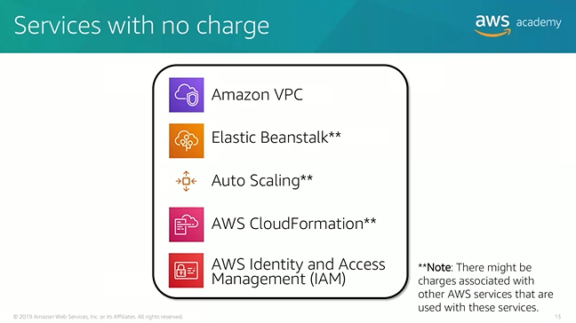
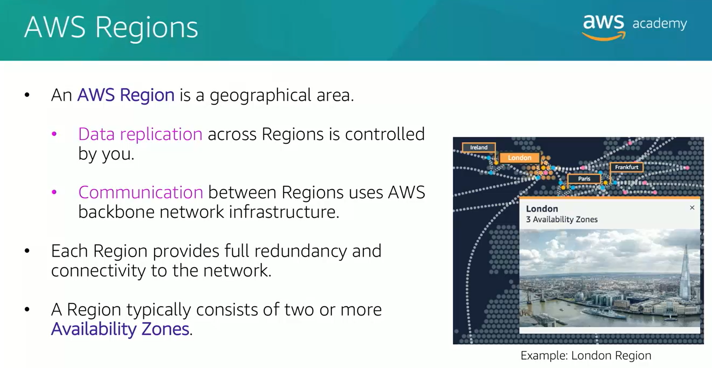

# Module 1
## Introduction to cloud computing

### 3 cloud service models
1. Iaas (infrastructure as a service)
2. Paas (platform as a service)
3. Saas (software as a service)

* more control over IT resources from 1 to 3.

### 3 cloud computing deployment models
1. Cloud -- all on cloud
2. Hybrid -- cloud and existing on premises
3. On-premises (private cloud)

### Difference between old and cloud

There are many similarities between AWS and the traditional, on-premises IT space:
* AWS security groups, network access control lists (network ACLs), and AWS Identity and Access Management (IAM) are similar to firewalls, access control lists (ACLs), and administrators.
* Elastic Load Balancing and Amazon Virtual Private Cloud (Amazon VPC) are similar to routers, 
network pipelines, and switches.
* Amazon Machine Images (AMIs) and Amazon Elastic Compute Cloud (Amazon EC2) instances are similar to on-premises servers.
* Amazon Elastic Block Store (Amazon EBS), Amazon Elastic File System (Amazon EFS), Amazon Simple Storage Service (Amazon S3), and Amazon Relational Database Service (Amazon RDS) are similar to direct attached storage (DAS), storage area networks (SAN),network attached storage (NAS), and a relational database management service (RDBMS).

## Advantage of the cloud
1. Trade capital expense for variable expense
* save money and time
-- you can pay only when you consume resources and pay only for the amount that you consume. Thus, you save money on technology.
-- use space as much as you need in minutes instead of weeks or days.Thus, maintenance is reduced.

2. Massive economies of scale
* save money because of wholesale
-- Because of aggregate usage from all customers, AWS can achieve higher economies of scale and pass savings on to customers.

3. Stop guessing capacity
* scaling on demand

4. Increase speed and agility
* 
  
5. Stop spending money on running and maintaining data centers
* 

6. Go global in minutes
* -- deploy your application in multiple AWS regions around the world.Thus, you can provide lower latency and a better experience for customer.

## Introduction to AWS(Amazon web services)

### What are web services?
* A web service is any piece of software that makes itself available over the internet and uses a standardized format--such as Extensible Markup language(XML) or JavaScript Object Notation(JSON)--for the request and the response of an application programming interface(API) interaction.

### What is AWS？
* 

### Categories of AWS services
* 
  
###  Services covered in this course
* 

### 3 ways to interact with AWS
* 

## Moving to the AWS Cloud
* using the cloud adoption Framework
### AWS Cloud Adoption Framework(AWS CAF)
* 

### Business perspective
* 
  
### People perspective
*   

### Governance perspective
* 
  
### Platform perspective
* 

### Security perspective
* 
  
### Operations perspective 
* 

## WrapUp

# Module 2
## Fundamentals of Pricing 
### AWS pricing model
#### 3 fundamental drivers of cost with AWS

1. *Compute* --charged per hour/second, varies by instance type
2. *Storage* --charged typically per GB
3. *Data transfer* --Inbound has no charge, outbound is aggregated and charged, charged typically per GB

#### How do you pay for AWS?

1. pay for what you use
   
2. pay less when you reserve
   
3. pay less when you use more and as AWS grows
   
> *charge every month*

#### AWS Free Tier

#### Services with no charge

> There are several free AWS services, including: 
•Amazon VPC
•Elastic Beanstalk
•AWS CloudFormation
•IAM
•Automatic scaling
services
•AWS OpsWorks
•Consolidated Billing 

1. Amazon Virtual Private Cloud (Amazon VPC)
enables you to provision a logically isolated 
section of the AWS Cloud where you can launch AWS resources in a virtual network that you 
define.
2. AWS Identity and Access Management (IAM)
controls your users’ access to AWS services and 
resources.
3. Consolidated Billing 
is a billing feature in AWS Organizations to consolidate payment for 
multiple AWS accounts or multiple Amazon Internet Services Private Limited (AISPL) 
accounts*. Consolidated billing provides:
   > One bill 
for multiple accounts.
•The ability to 
easily track 
each account’s charges.
•The opportunity to decrease charges as a result of volume pricing discounts from 
combined usage
•And you can consolidate all of your accounts using Consolidated Billing and get tiered 
benefits.
4. AWS Elastic Beanstalk 
is an even easier way for you to quickly deploy and manage applications 
in the AWS Cloud.
5. AWS CloudFormation
gives developers and systems administrators an easy way to create a 
collection of related AWS resources and provision them in an orderly and predictable fashion.
6. Automatic Scaling
automatically adds or removes resources according to conditions you 
define. The resources you are using increase seamlessly during demand spikes to maintain 
performance and decrease automatically during demand lulls to minimize costs.
7. AWS OpsWorks 
is an application management service that makes it easy to deploy and 
operate applications of all shapes and sizes.

## Total cost of ownership
### On-premises versus cloud

### What is Total Cost of Ownership(TCO)?

1. TCO is the financial estimate to help identify direct and indirect costs of a system
2. why use TCO ?
   1) To compare the costs of running an entire infrastructure environment or specific workload on-premises versus on AWS
   2) To budget and build the business case for moving to the cloud

### TCO considerations --on-premises

### On-premises versus all-in-cloud

### AWS Pricing Calculator

### Additional benefit considerations

### AWS Organizations
> AWS Organization is a free account management service that enables you to consolidate multiple AWS accounts into an organizational tree with each branch representing a department or team.

1. AWS Organizations terminology
   
2. Key features and benefits
   
3. Security with AWS Organizations
   
4. Organizations setup
     
5. Accessing AWS organzations
    
  
### AWS Billing
 
 #### Tools
 
 #### Bills page
 
 
 
 

### Technical Support Models

> The TAM can provide guidance, 
architectural review, and continuous ongoing communication to keep you informed and prepared 
as you plan, deploy, and optimize your solutions.

> AWS Trusted Advisor is like a 
customized cloud expert.
It 
is an online resource that checks for opportunities to reduce monthly 
expenditures and increase productivity.

> Support Concierge 
is a billing and account expert who will provide 
quick and efficient analysis on billing and account issues. The concierge addresses all non
-technical billing and account-level inquiries. 

# Module 3
## AWS Global Infrastructure
The AWS Global Infrastructure is designed and build to deliver a flexible, reliable, scalable, and secure cloud computing environment with high-quality global network performance.
### AWS Regions

> Data wil not be duplicated without the region.
> Data duplication from one region to another is decided by users.
### Selecting a Region

### Availability Zones
 
### AWS data centers
    
>ODMs: Original Device Manufacturers
### Point of Presence     
                             
>入网点：网络服务提供点又称入网点（POP，Point of Presence），是不同网络或通信设备相互建立连接的接入点。POP必需有一个唯一的IP地址。互联网服务提供商（ISP）或 互联网内容提供商（ICP）在互联网上至少有一个入网点，而其入网点数量常被用来衡量规模和增长速度。

>Amazon CloudFront： a global content Delivery Network(CDN),that delivers content to end users with reduced latency.

>Amazon Route 53 is a Domain Name System, DNS service.

>Regional edge cashes are used by default with Amazon CloudFront.

### AWS infrastructure features

